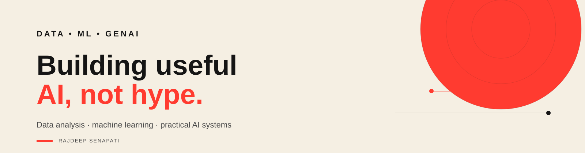

  

 

  
  
  

 

## About

I'm a Data Science graduate working across **data, machine learning, and practical AI**.

I like taking a messy problem, figuring out what actually matters, and building something useful around it.

`data → analysis → model → useful output`

## Tools I use

**Data**  
Python · SQL · pandas · NumPy · Power BI · PySpark

**Machine Learning**  
scikit-learn · XGBoost · forecasting · feature engineering

**GenAI**  
LLMs · RAG · LangChain · Hugging Face · agents

**Build & deploy**  
Streamlit · Flask · PostgreSQL · Azure · AWS

## Selected work

<table>
<tr>
<td width="50%">

### StockSense

Retail demand forecasting and inventory decision support.

`541,909 transactions` · `3,936 SKUs` · `10.25 MAE`

</td>
<td width="50%">

### JobShield

LLM workflow for job-risk analysis and evidence-based resume matching.

`Python` · `Groq` · `Streamlit`

</td>
</tr>
<tr>
<td width="50%">

### Bank Nifty Research

XGBoost-based index forecasting.

`R² = 0.9499` · `XGBoost` · `Time Series`

</td>
<td width="50%">

### Route Optimizer

Route planning combining optimization, a web interface, and an AI layer.

`React` · `Flask` · `OR-Tools`

</td>
</tr>
</table>

## GitHub activity

  
  

## Research

During my research internship at Jadavpur University, I worked on Alzheimer's disease stage classification using MRI-derived volumetric biomarkers.

The work combined **statistical feature selection** with **XGBoost** across multiple binary classification tasks.

## More repositories

  
  
  
  
  

 

  Building useful AI, not hype.

